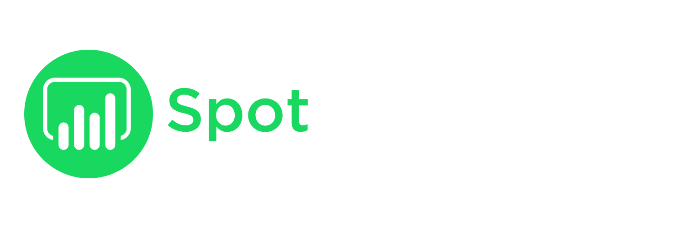

  

## 📚 Índice
1. [🎧 ¿Qué es SpotInsights?](#-qué-es-spotinsights)
2. [⚙️ ¿Qué hace el Backend?](#-qué-hace-el-backend)
3. [🚀 Deployment](#-deployment)
4. [🛠️ Tecnologías utilizadas](#️-tecnologías-utilizadas)
5. [📦 Diagrama de clases UML](#-diagrama-de-clases-uml)
6. [🔐 Autenticación con Spotify](#️-autenticación-con-spotify)
7. [📚 Documentación de la API de Spotify](#️-documentación-de-la-api-de-spotify)
8. [🧑‍💻 Autoría y propiedad intelectual](#️-autoría-y-propiedad-intelectual)

---
## 🎧 ¿Qué es SpotInsights?

**SpotInsights** es un proyecto que integra el Desarrollo FullStack con el Análisis de Datos. Su objetivo principal es recopilar y analizar los datos de reproducción musical de los usuarios a través de la API de Spotify.

El proyecto se compone de tres partes:

- **Frontend:** presenta el proyecto al usuario, explica su propósito y permite autorizar el acceso a sus datos musicales.

- **Backend (este repositorio) :** recibe y almacena los datos en una base de datos, y se encarga de actualizar automáticamente las reproducciones de los usuarios cada cierto período.

- **Análisis de datos:** accede a la base de datos y genera un dashboard en Power BI para visualizar patrones de escucha de la comunidad.

---

## ⚙️ ¿Qué hace el Backend?

El backend es responsable de:

- Conectarse de forma segura con la API de Spotify mediante Client Credentials.
- Exponer un endpoint que permite recibir datos de reproducción musical tras la autenticación del usuario en el Frontend.
- Guardar esos datos en una base de datos PostgreSQL, actualmente alojada en Supabase.
- Ejecutar tareas automatizadas periódicas para mantener actualizadas las reproducciones.

Este backend es parte del ecosistema **SpotInsights**, que también incluye:

- Un [Frontend en React](https://github.com/emijordan/spotinsights-frontend)
- Un futuro dashboard en Power BI para visualización de patrones musicales comunitarios.

---
## 🚀 Deployment
Este backend fue desplegado utilizando **Render**, junto con una imagen Docker personalizada. Aunque no expone una API pública, está pensado para ser consumido por el frontend del proyecto SpotInsights.

Actualmente, el entorno productivo utiliza:

- Una base de datos alojada en Supabase (PostgreSQL).

- Variables de entorno gestionadas desde el panel de Render.

- Un perfil de ejecución `prod` configurado para entornos de producción.

> [!WARNING]
>
> Este backend no ofrece endpoints públicos. Solo responde a solicitudes provenientes del frontend autenticado.
---
## 🛠️ Tecnologías utilizadas

- **Java 17**
- **Spring Boot**
  - **Spring Data JPA** (Gestión de base de datos)
  - **Spring Scheduling** (Tareas automatizadas)
  - **Spring Security Crypto** (encriptar datos sensibles)
- **Flyway** (Migraciones de base de datos)
- **Supabase** (PostgreSQL como motor de base de datos)
- **Maven** (Gestor de dependencias)
- **Docker** (para empaquetar y desplegar la aplicación)
- **Render** (Deployment del proyecto)
- **Spotify Web API**

---

## 📦 Diagrama de clases UML

En esta sección se presenta el diagrama de clases UML con las principales entidades utilizadas en el backend. El diagrama muestra cómo se relacionan los modelos de dominio —como User, Song, Artist, Album y Reproduction— y cómo fluye la información dentro de la aplicación.

También, el sentido de la flecha, permite visualizar qué entidad contiene a otra, lo que ayuda a entender la estructura del sistema y cómo se organizan los datos internamente.

---

## 🔐 Autenticación con Spotify

El backend utiliza el **Client Credentials Flow** para autenticarse con Spotify y solicitar datos de reproducción. Este enfoque es ideal para tareas automatizadas, sin requerir una sesión activa de usuario.

---

## 📚 Documentación de la API de Spotify
Todos los datos de canciones, artistas, álbumes y reproducciones que utiliza este backend se obtienen a través de la API oficial de Spotify.

🔗 Podés consultar la documentación oficial de Spotify aquí: https://developer.spotify.com/documentation/web-api

---
## 🧑‍💻 Autoría y propiedad intelectual
**SpotInsights** es un proyecto personal desarrollado de manera integral por Emiliano Jordan.

Todo el diseño, desarrollo frontend y backend, análisis de datos, visualizaciones, así como los elementos gráficos (como el logo), han sido ideados y construidos por el autor.

Este repositorio forma parte de una iniciativa profesional orientada a demostrar habilidades en Desarrollo FullStack y Análisis de Datos.

Todos los derechos reservados © 2025 Emiliano Jordan.

Este proyecto no está afiliado ni respaldado por Spotify.
